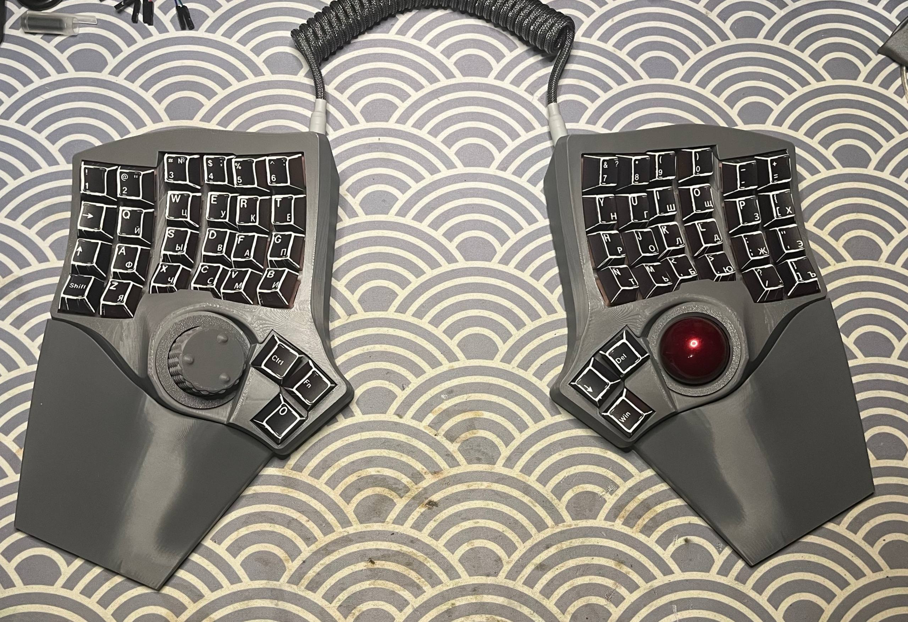
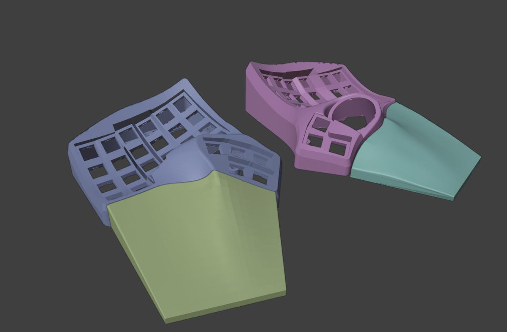

# ⌨️ Подставка под запястья / Стенд для Charybdis и Scylla (mk2)

[-red)](https://github.com/Bastardkb)

Кастомная эргономичная подставка под запястья / стенд для 3D-печати, разработанная специально для сплит-клавиатур **Charybdis** и **Scylla** в корпусе версии **mk2** от [Bastardkb](https://bastardkb.com/).

---

## 📸 Галерея

<p align="center">
  
  
</p>

---

## ✨ Особенности

- **Двойная совместимость:** Отдельные адаптированные модели как для **Charybdis**, так и для **Scylla** (корпус mk2).

- **Исходные файлы в комплекте:** Включает полные файлы проектов `.blend` для Blender, если вы хотите изменить, доработать или настроить модель под себя.

- **STL-файлы, готовые к печати:** Предварительно ориентированные STL-файлы, оптимизированные для прямой 3D-печати.

- **Эргономичный дизайн:** Помогает снять напряжение с запястий во время длительной работы с текстом или игровых сессий.


---

## 📂 Структура репозитория

```text
├── images/
│   ├── charybdis.jpg          # Реальное фото / превью
│   └── viewport.jpg           # Скриншот вьюпорта Blender
├── models/
│   ├── charybdis wirst rest.blend  # Исходный файл Blender
│   ├── charybdis wirst rest.stl    # Готовый к печати STL для Charybdis
│   └── scylla wirst rest.stl       # Готовый к печати STL для Scylla
├── LICENSE                    # Информация о лицензии
└── README.md                  # Документация проекта
```
---

## 🛠️ Настройка и редактирование

Если вы хотите изменить геометрию, посадку или угол наклона:
1. Откройте `models/charybdis wirst rest.blend` в **[Blender](https://www.blender.org/)**.
2. Измените меш или подгоните размеры по своему вкусу.
3. Экспортируйте обратно в `.STL` для слайсинга.

---

## 🙏 Благодарности и авторы

- **Дизайн клавиатур:** Исходные геометрические референсы клавиатур созданы Квентином из **[Bastardkb](https://bastardkb.com/)** ([Репозиторий на GitHub](https://github.com/Bastardkb)).
- Разработано специально для ревизии корпуса **mk2** клавиатур Charybdis и Scylla.
